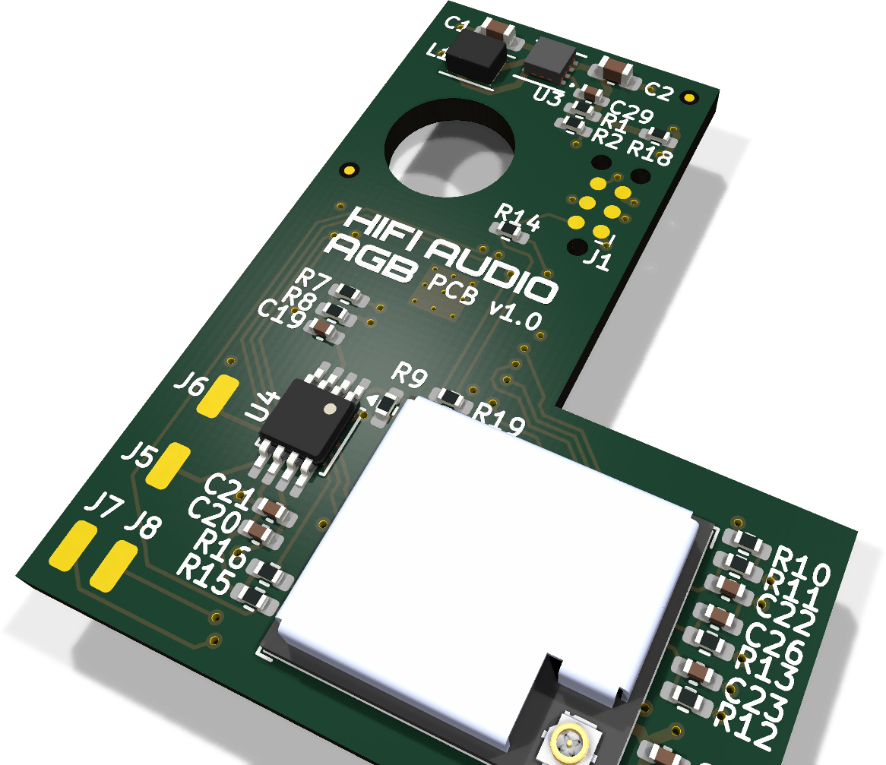
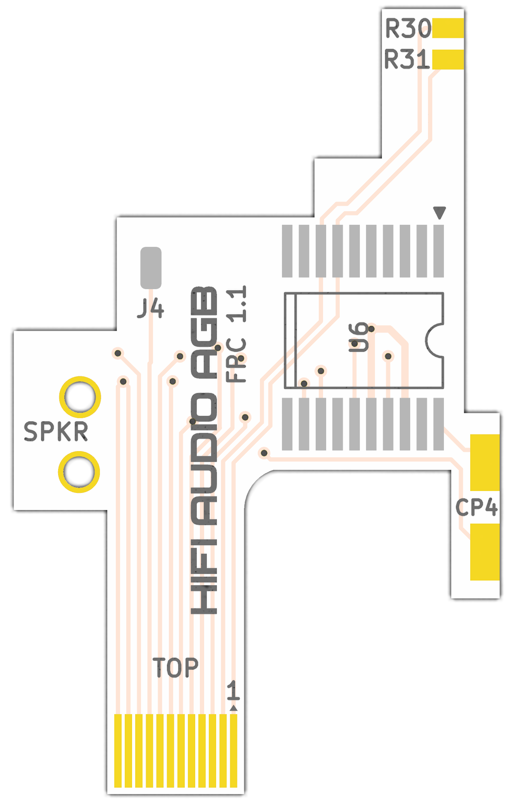

# GameBoy HiFi Audio

A Bluetooth audio upgrade for the Game Boy Advance. It removes the console's
stock audio amp and replaces the whole audio back end with an ESP32 and an
ES8388 codec. The mod streams game audio to Bluetooth headphones and speakers,
and it also drives the GBA's built-in speaker and wired headphone jack itself,
with onboard EQ, volume, and sound effects.

<p align="center">
  
  &nbsp;&nbsp;
  
  <br>
  <sub>AGB main board (left) and flex (right)</sub>
</p>

What you get:

- Bluetooth (A2DP) output to any standard headphones or speaker.
- Wired headphones and the internal speaker, driven by the onboard codec.
- EQ, volume, and sound-effect cues, tunable from a phone or laptop over
  Bluetooth (no app install, it runs in the browser).
- A battery-saver mode that puts the radio and CPU to sleep and passes audio
  through the codec in analog, for long unplugged sessions.
- Firmware updates over Bluetooth.

Prebuilt, pre-assembled kits are available at [cajunpanda.com](https://cajunpanda.com)
if you would rather not source the parts and solder it yourself. Kits ship
pre-flashed and update over Bluetooth, so they need no programming cable.

This repository currently holds the board for the original Game Boy Advance
(AGB). The firmware is shared across models. Boards for other Game Boy models
will be added under `hardware/` as they are designed.

## Pick your path

This project has three kinds of reader. Start with the doc that matches you.

- **You have a GameBoy HiFi board, or one already in your GBA.**
  [docs/AGB-INSTALL.md](docs/AGB-INSTALL.md) fits the board into a Game Boy Advance, and
  [docs/MANUAL.md](docs/MANUAL.md) covers using it: pairing, the control button,
  the modes, the web config page, and troubleshooting.

- **You want to build the boards yourself.**
  Read [docs/HARDWARE.md](docs/HARDWARE.md): the bill of materials, the KiCad
  boards, fabrication, and assembly. It links on to the install guide once the
  boards are ready.

- **You want to change the firmware.**
  Read [docs/FIRMWARE.md](docs/FIRMWARE.md): the toolchain, build and flash,
  the architecture, the config options, and how the control surfaces work.

## Repository layout

```
firmware/        ESP-IDF firmware (PlatformIO project), shared across boards
hardware/agb/    KiCad projects for the AGB main board and flex (schematic carries the BOM)
web/             Web Bluetooth config page (hosted on GitHub Pages)
tools/           serial_proxy.py (serial monitor and flasher), make_clip.py (clip authoring)
docs/            the guides above
```

## License

- Firmware and other source code: MIT, see [LICENSE](LICENSE).
- Hardware (schematics, board layouts, footprints): CERN-OHL-P v2, see
  [hardware/LICENSE](hardware/LICENSE).
- Documentation: CC BY 4.0, see [docs/LICENSE](docs/LICENSE).

You can build, modify, sell, and redistribute all of it, including in your own
products, as long as you keep the attribution and the license notices.

## A note on the trademark

Game Boy and Game Boy Advance are trademarks of Nintendo. This is an
independent, unofficial project and is not affiliated with or endorsed by
Nintendo.
