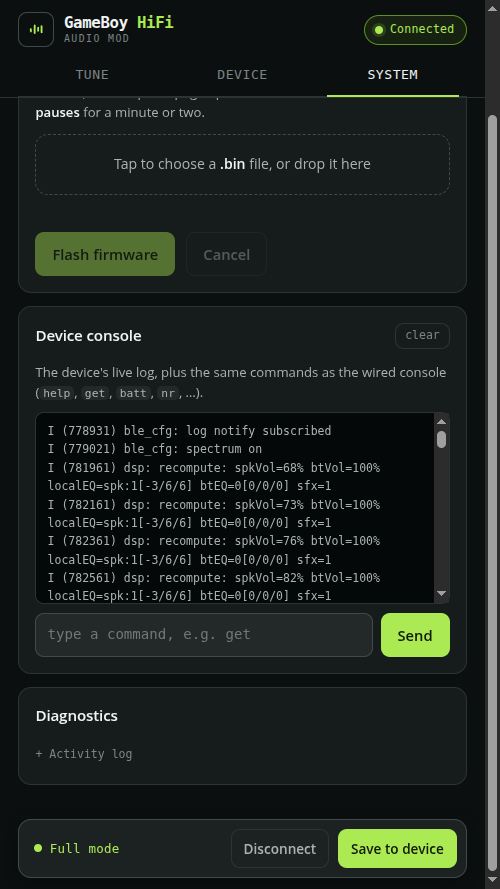

# GameBoy HiFi Audio: Firmware Guide

This guide is for building, flashing, and modifying the firmware. The firmware
is shared across all board models.

## Toolchain

The firmware is an ESP-IDF project built through PlatformIO, not through
`idf.py`. You need:

- PlatformIO (the `pio` CLI, or the VS Code extension).
- A Tag-Connect TC2030 serial cable for the first cabled flash. The
  [TC2030-NL-FTDI-C232HD](https://www.tag-connect.com/product/tc2030-nl-ftdi-c232hd-ddhsp-0-dtr-usb-to-tc2030-no-legs-serial-cable)
  carries DTR for auto-reset into the bootloader. Later updates go over Bluetooth.

PlatformIO downloads the ESP-IDF framework and the managed components on the
first build. `firmware/sdkconfig.defaults` is the source of truth for the IDF
configuration; the generated `sdkconfig.prod` is not checked in and is
recreated from the defaults.

## Build, flash, monitor

All firmware commands run from inside `firmware/`:

```sh
cd firmware
pio run                          # build
pio run -t upload                # flash over serial
pio run -t upload -t monitor     # flash and open the serial monitor
pio run -t menuconfig            # IDF menuconfig (edits the generated sdkconfig)
pio device monitor               # serial monitor only (115200 8N1)
```

The build output is `.pio/build/prod/firmware.bin`.

### Recommended: benchmux for iterating

For a build-flash-watch loop, [benchmux](https://github.com/cajunpanda/benchmux) is more
convenient than the raw `pio` commands. It owns the serial port and tees output to a shared
logfile, so it flashes without stopping the monitor, the boot log for the new firmware
streams straight into the log you are already watching, and you can follow that log from any
terminal. It also flashes over BLE. Install it per its README, then from `firmware/`:

```sh
serial_proxy.py monitor --port FTDI &    # own the port, stream to /tmp/serial_proxy.log
serial_proxy.py tail                     # follow the log (from any terminal)
serial_proxy.py flash --env prod         # build + upload without stopping the monitor
serial_proxy.py flash --env prod --fs    # also flash the LittleFS clip image
serial_proxy.py send get                 # inject a console command through the monitor
```

`--fs` flashes the LittleFS clip image that a plain upload skips (see "Partitions and the
clip image"), so a `firmware/data/` change needs no separate esptool step. The commands run
once and exit with a status code, which also makes benchmux a good fit for driving the board
from an editor task or an AI coding agent.

If you change `sdkconfig.defaults`, delete `sdkconfig.prod` to force it to
regenerate. Adding a new `CONFIG_*` symbol in `Kconfig.projbuild` also needs
that delete plus a rebuild, otherwise the build reports the symbol as
undeclared.

`pio run -t upload` flashes only the app. It does not write the LittleFS clip
image, so a change under `firmware/data/` needs a separate filesystem flash (see
"Partitions and the clip image" below).

## Configuration

Project options live in `firmware/src/Kconfig.projbuild` under the
"GameBoy HiFi Audio" menu. Reach them with `pio run -t menuconfig`. The groups:

- **Timeouts and timing**: standby and reconnect timing, the silence detector,
  the R-button hold thresholds, debounce, pairing and wake-hold times, and the
  factory-reset hold.
- **BLE GATT config server**: enables the Web Bluetooth control surface.
- **Speaker DSP defaults**: first-boot seed values for volume, the three EQ
  profiles (speaker, headphone, Bluetooth), and the sound cues. These are only
  the initial seeds; live values persist in NVS and are tuned at runtime.
- **Operating modes**: the default mode at boot, and what happens on a wired
  headphone unplug while in Battery saver.
- Two debug toggles: per-second ADC peak logging, and a one-shot waveform dump
  over UART.

## Partitions and the clip image

`firmware/partitions.csv` defines an 8 MB layout with two OTA app slots (so the
firmware can update itself over Bluetooth), an NVS area for settings and
Bluetooth bonds, and a LittleFS `storage` partition for sound clips.

`pio run -t upload` flashes only the app. It does not flash the LittleFS clip
image, so a plain flash leaves whatever clips were already on the board. The
build bakes `firmware/data/` into a `storage.bin` image (the `src/CMakeLists.txt`
`littlefs_create_partition_image(... FLASH_IN_PROJECT)` line owns the exact
fs-size / block-size / name-max the firmware mounts with). To (re)load the clips,
build and write that image to the `storage` partition offset:

```sh
pio run                                              # bakes .pio/build/prod/storage.bin
esptool.py write_flash 0x420000 .pio/build/prod/storage.bin
```

The `storage` offset (`0x420000`) comes from `partitions.csv`; the generated
`flasher_args.json` lists it too.

The first flash on a fresh board must be a full cabled flash: bootloader,
partition table, app into the first slot, an erased otadata, and the clip image.
After that, updates can go over Bluetooth.

The clips themselves are in the GSFX format. Use `tools/make_clip.py` to author
them: `from-wav` converts a 16-bit WAV to a clip (downmix + optional resample),
or `gen-startup` generates a synth test cue. `startup.gsfx` is the boot chime the
mod plays over a muted passthrough (see "Init order"); to replace it, author a new
`firmware/data/startup.gsfx` and reflash the filesystem image (see "Partitions and
the clip image"). The web config page can also upload clips to a running board.

## Source layout

```
firmware/src/
  main.c            app_main and the boot/init order
  pinmap.h          every PIN_* macro (the single source of truth for GPIOs)
  es8388.{h,c}      codec driver over I2C: power-up, mode, routing, volume
  i2s_codec.{h,c}   full-duplex I2S master to the codec (MCLK from the ESP32)
  audio_pipeline.{h,c}  ADC capture, int16 conversion, DSP, BT stream, DAC fan-out
  dsp.{h,c}         EQ, volume, and cue mixing for the speaker and BT paths
  settings.{h,c}    runtime-tunable parameters, NVS-backed, the control seam
  sfx.{h,c}         cue player: synth cues and clips streamed from LittleFS
  fs.{h,c}          LittleFS mount for the clip store
  console.{h,c}     UART REPL control surface
  ble_config.{h,c}  BLE GATT config server (drives the web page)
  bt_a2d.{h,c}      Bluedroid wrapper: connect, pair, media, bonds, events
  buttons.{h,c}     debounced ISR for the control button and HP-detect
  app_sm.{h,c}      the state machine, speaker-amp gating, and sleep policy
```

## Architecture

### Audio path

The GBA sound pins (S01/S02) are a PWM bitstream. A reconstruction low-pass
filter on the board turns that into analog, which feeds the codec line inputs.
From there:

```
codec ADC -> ESP32 (I2S RX) -> int16 stereo -> DSP -> split:
  Bluetooth:  stream buffer -> A2DP SBC encoder -> radio
  Local:      codec DAC -> headphone amp (jack) and line out -> speaker amp
```

The pipeline is fixed at 44.1 kHz interleaved stereo, 16-bit. The IDF A2DP
source endpoint hard-codes that SBC format and rejects attempts to change it, so
the sample rate, channel count, and bit depth across the codec, the I2S bus, and
the pipeline all exist to feed that fixed sink. Do not change one without the
others.

### Clocking

The ESP32 is the I2S master. It generates MCLK (from the APLL on GPIO0), BCLK,
and LRCK, and the codec is the slave. One clock domain serves both directions,
so there is no asynchronous resampling.

### Init order

`app_main` is ordered to get **audio out as fast as possible** and to keep the
Bluetooth radio off the Game Boy power-on chime. The mod boots on the GBA's
switched rail, so every power-cycle re-runs this and the chime is the first thing
the user hears.

The sequence: log the wake cause and gate a button wake, boot-mute the speaker
amp, init NVS, bring up the I2S clocks and then the codec over I2C. As soon as the
codec is configured, `app_sm_speaker_early_on()` samples HP-detect and unmutes the
speaker amp (only if no headphones are plugged) — well before the state machine
would otherwise. Then the DSP subsystem comes up: `app_sm_prime_volume()` seeds
the speaker volume from the wheel *before* `dsp_init()` reads it (so a wheel-down
user doesn't get a default-volume blare), and the local EQ profile is seeded from
the sampled HP state. The startup chime is then triggered — `dsp_begin_intro()`
mutes the live passthrough while `sfx_trigger_clip("startup")` plays the mod's own
clean, complete chime (so it isn't doubled with the truncated live GBA chime the
codec misses during boot); this is gated so a future setting can disable it and
let the GBA's own chime through. The audio pipeline and buttons start, and the
pending OTA image is confirmed good.

Only then comes Bluetooth, deliberately last among the heavy loads: `app_main`
waits until `CONFIG_GBHIFI_BT_START_DELAY_MS` after power-on **and** until the
startup chime has fully drained (`sfx_cue_active()`, capped so a wedged cue can't
block BT), parks the speaker amp (`app_sm_amp_radio_quiet()`) across the radio
window, then runs `bt_a2d_init()` (controller + radio) and the BLE config server.
This serialization exists because the radio bring-up is the largest, fastest
current step of the whole boot and on a low battery it can sag the boost rail
below the brownout threshold. Three more pieces of that guard live in firmware:

- `CONFIG_ESP_PHY_RF_CAL_NONE=y` (sdkconfig.defaults) — skips the boot-time
  partial RF calibration TX bursts and runs from NVS-stored cal data. Caveat:
  the first boot after an NVS erase runs a *full* cal (bigger spike), where the
  loop breaker below is the safety net.
- **BR/EDR TX capped at -3 dBm right after controller enable** (bt_a2d.c), so
  inquiry/page bursts never run at the +9 dBm default; the CONNECTED handler
  re-asserts the same level per link.
- **Brownout loop breaker** (main.c): an RTC-noinit magic word is armed around
  the radio bring-up and cleared on success. A boot that starts with reset
  reason BROWNOUT while armed knows the radio killed it: the first strike
  retries after a 2 s settle, two consecutive strikes skip BT for that boot and
  come up LOCAL_ONLY (chime + local audio always play instead of a reboot
  loop). A real power cycle scrambles RTC noinit and re-arms BT. All public
  `bt_a2d_*` calls no-op safely on a BT-skipped boot.

This sequence cold-boots cleanly down to a 2.0 V rail, below any usable 2xAA
level. Finally the factory-reset check, the state machine, and the console start.
The order matters; read the comments in `main.c` before reordering anything.

There is no codec read-back verify pass: the production PCB's series-R + short
MCLK routing keep the I2C config writes clean, so `es8388_init()` alone is enough.

### State machine

`app_sm.c` is the only place that owns device state. Button events, Bluetooth
events, audio silence edges, and timers all fold into one FreeRTOS queue drained
by a single task, so there are no cross-task races on the state. It also owns
the speaker-amp mute policy and the sleep policy.

The audio pipeline and the Bluetooth wrapper are isolated from each other and
from the state machine. They publish events through callbacks, and the state
machine is the only subscriber. Keep that boundary: do not add direct calls
between modules.

### Real-time threading

The real-time audio tasks are pinned to core 1, off the Bluetooth controller
core, or A2DP streaming gets garbled when the controller preempts a shared core.
Tickless idle is off for the same timing reason. There is no per-sample `sinf`
or `expf` in the audio task; the DSP uses lookup tables.

## Settings and control surfaces

`settings.c` is the single source of truth for runtime-tunable parameters
(volumes, the EQ profiles, the cues, the mode preferences, the hold times). It
is thread-safe, NVS-backed, and versioned, with a generation counter so the DSP
recomputes coefficients only when something changes.

Control surfaces only ever call the `settings_*` and `sfx_*` API. They never
touch the audio path. There are two:

- **The UART console** (`console.c`): a REPL for bring-up and tuning.
- **The BLE config server** (`ble_config.c`): the same API exposed over
  Bluetooth for the web page.

### Console commands

```
vol <0-100>          speaker volume
volbt <0-100>        Bluetooth volume
eq on|off [b m t]    speaker EQ
eqhp on|off [b m t]  headphone EQ
eqbt on|off [b m t]  Bluetooth EQ
sfx on|off [level]   cue mixing
chime [name]         play a synth cue
play <name>          play a clip
bt connect|pair      drive BT like the button (page bonds / inquiry-pair)
mode a|b             set operating mode (a = bypass/battery, b = DSP)
unplug stay|b        behavior on HP unplug in Mode A
hold [c p m e]       R-button hold thresholds, ms
wheel on|off         VOL wheel drives volume
ls                   list the clip store
save                 persist settings to NVS
get                  show current settings
```

There are also a few bench helpers (`out1`, `out2`, `outvol`, `codecmode`,
`hp`, `sleep`) for hardware bring-up.

## Web config page

`web/index.html` is a single static page that talks to the BLE config server
over Web Bluetooth. There is no build step and no backend. It is published to
GitHub Pages by `.github/workflows/pages.yml` on any push that touches `web/`.
Web Bluetooth needs a secure context, which the Pages HTTPS provides. The page
reads and writes the settings, uploads clips, and pushes firmware updates.

The System tab mirrors the UART REPL: it streams the device log and takes the
same console commands (`help`, `get`, `batt`, `nr`, ...), so you can watch and
poke a running board over BLE with no cable.

<p align="center">
  
  <br>
  <sub>The System tab's device console: the live log and the same commands as the wired console, over Bluetooth.</sub>
</p>

## OTA updates

The firmware can update itself over Bluetooth. The web page pushes a new
`firmware.bin` to the BLE OTA characteristics; the device writes it to the
inactive app slot, verifies it, swaps the boot slot, and reboots. If a fresh
image fails to finish booting, the bootloader rolls back to the previous slot.
The running image confirms itself good only after init completes without a
panic.

## Board targets

The build targets the ESP32-PICO-MINI-02-N8R2 module (8 MB flash) on the
production board. `pinmap.h` holds every GPIO assignment and is the single source
of truth for pins; the flash size and partition table are set in
`sdkconfig.defaults` and `partitions.csv`. There is one PlatformIO env, `prod`,
so the build output is always `.pio/build/prod/firmware.bin`.

To bring the firmware up on a different ESP32 module (for example a dev board on
the bench), add a PlatformIO env and adjust the GPIO values in `pinmap.h`, which
is the only file the pin map lives in.
