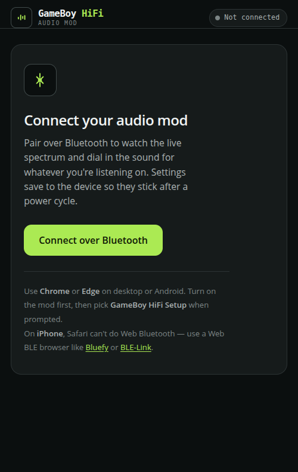
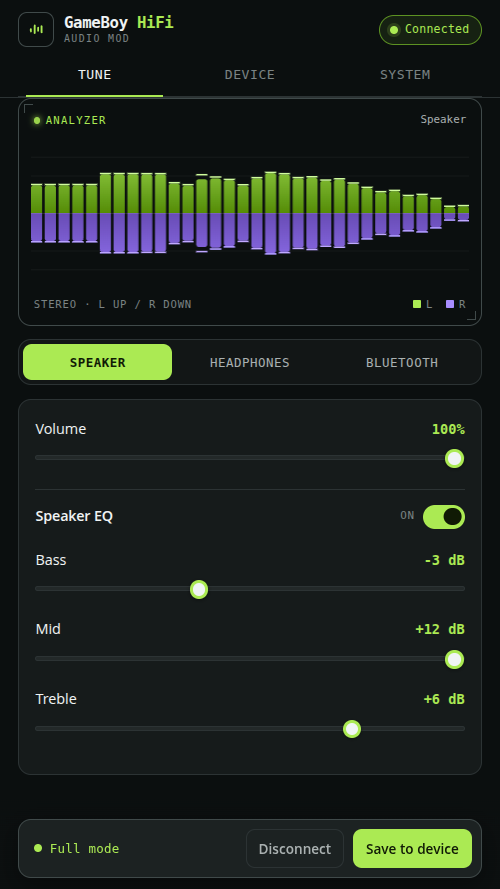
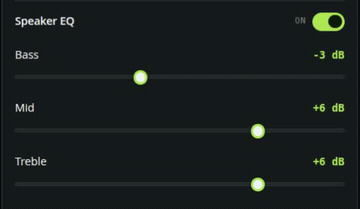
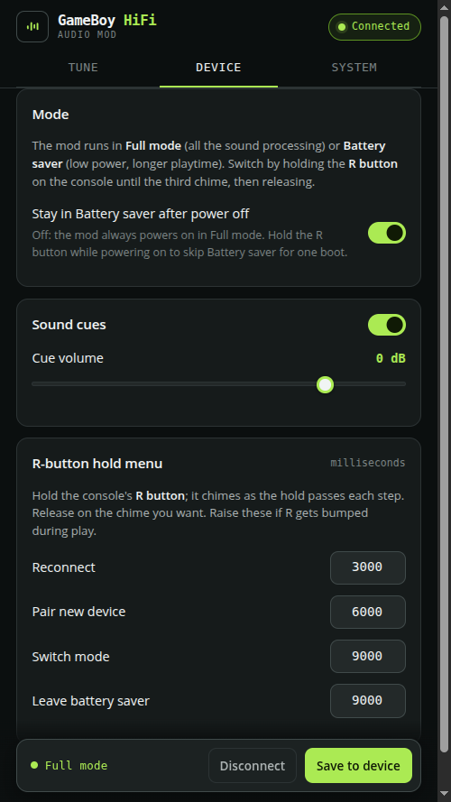
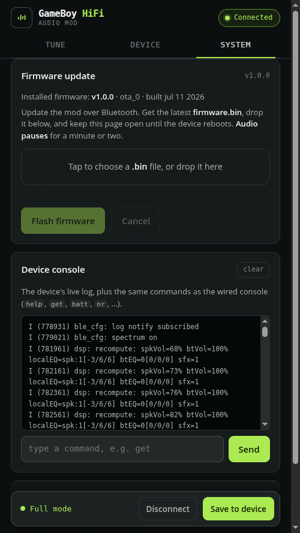

# GameBoy HiFi Audio: User Manual

This guide is for using a Game Boy Advance that has the mod installed. If the mod
is not installed yet, see [AGB-INSTALL.md](AGB-INSTALL.md) first. To build the boards
yourself, see [HARDWARE.md](HARDWARE.md).

## What it does

The mod replaces the GBA's audio amplifier with a small board built around an
ESP32 and an audio codec. Once it is installed:

- Game audio streams to Bluetooth headphones or a Bluetooth speaker.
- The GBA's own speaker and headphone jack still work, and they sound better,
  because the board runs the audio through an equalizer and a proper headphone
  amp.
- You can adjust the sound from a phone or laptop over Bluetooth, in the
  browser, with no app to install.

The board is powered from the GBA's battery rail, so it turns on and off with
the console. There is no separate switch.

## The control button

There is one control: the right shoulder button (R). It does double duty. In
games it works as the normal R button, and a quick tap never triggers anything
on the mod. To control the mod you press and hold it.

While you hold R, the device plays a short chime each time you cross a step.
Let go on the step you want:

- Hold about 3 seconds (one chime): connect to your saved headphones.
- Hold about 6 seconds (second chime): enter pairing mode for a new device.
- Hold about 9 seconds (third chime): switch between Full mode and Battery
  saver.

If you hold past a step you do not want, just keep holding to the next one. If
you let go before the first chime, nothing happens.

These hold times can be changed from the web config page if the defaults do not
suit you.

## Pairing your first headphones

1. Turn on the GBA.
2. Put your Bluetooth headphones or speaker into their own pairing mode.
3. Hold R until you hear the second chime (about 6 seconds), then let go. The
   mod is now searching.
4. When it finds your headphones it connects and plays a confirmation chime.

The mod remembers what it paired with, but it does not turn Bluetooth on by
itself. When you turn the GBA on it starts up quietly on the speaker and wired
jack and waits for you. To connect your saved headphones, hold R until the first
chime (about 3 seconds) and let go; it reconnects and plays a confirmation
chime. You only use pairing (the second chime) when you want to add a new
device.

If you have paired more than one device, the first chime tries the most recently
used one first, then cycles through the others.

Once you are connected, a brief dropout fixes itself. If the headphones go out
of range or you turn them off and on, the mod reconnects on its own. It only
gives up, and waits for you to hold R again, if it cannot get them back after a
short while.

If you prefer the mod to reconnect to your saved headphones automatically the
moment you power on, that is available as a saved option. It is off by default so
the radio stays quiet until you ask for it.

## Wired headphones and the speaker

Plug headphones into the GBA's headphone jack and the internal speaker mutes
automatically, the same as a stock console. Unplug them and the speaker comes
back. The board drives the wired jack directly, so wired headphones work even
when nothing is paired over Bluetooth.

## Volume

Use the GBA's volume wheel as usual. It sets the volume for the speaker and the
wired jack. Bluetooth headphones have their own volume control; use that for
Bluetooth listening.

## Full mode and Battery saver

There are two operating modes.

- **Full mode** is the default. It runs the equalizer and sound effects, and it
  streams to Bluetooth. This is the mode you want most of the time.
- **Battery saver** passes the audio straight through in analog and puts the
  processor and radio to sleep between adjustments. It plays through the speaker
  and wired headphones only. The equalizer, sound effects, and Bluetooth
  streaming are paused while it is on. Use it for long sessions when you are
  listening on the speaker or wired headphones and want the most battery life.

Switch between them by holding R to the third chime (about 9 seconds) and
letting go. This works at any time, including while the mod is searching for
headphones: switching to Battery saver stops the search right away and does not
make you wait. In Battery saver there is no chime menu, so to leave it just hold
R for about 9 seconds; the equalizer audio coming back and a chime tell you it
switched.

## Battery life

The mod runs off the GBA's battery rail, so it adds to the console's draw. The
current column below is the extra draw the mod puts on the battery, measured at
the battery terminals; it shifts a little with pack voltage. The runtimes are
rough figures on a fresh pair of AA alkaline cells, listening on the speaker.

| What you are doing | Extra current from the mod | Runtime |
| --- | --- | --- |
| Full mode, local speaker/headphones | ~80 mA | ~13 hours |
| Battery saver, local speaker/headphones | ~30 mA | ~14 hours |
| Bluetooth streaming | ~200 mA | ~9 hours |

Bluetooth is by far the heaviest mode, because the radio draws current in bursts;
if you are not using it, Full mode on the speaker or wired jack lasts much longer,
and Battery saver stretches it a little further still.

These figures are for a stock GBA. If your console has a backlit **IPS screen
mod**, the backlight draws more than the audio mod does, and it roughly halves
every number above (expect about 5 hours of Bluetooth streaming). Turning the
screen brightness down is the most effective way to get that time back.

## The web config page

The config page runs in your browser and talks to the mod over Bluetooth, so it
works from a phone or a laptop with no install. It needs a browser that
supports Web Bluetooth (Chrome or Edge on Android, Windows, macOS, or Linux;
Web Bluetooth is not available in Safari or on iOS).

Open the page:

```
https://cajunpanda.github.io/gameboy-hifi-audio/
```

Then:

1. Turn on the GBA so the mod is running.
2. Click Connect and pick **GameBoy HiFi Setup** from the list.
3. The controls fill in with the current settings. Changes apply live as you
   move them.
4. Click Save to device to keep the changes after a power cycle.

<p align="center">
  
  &nbsp;&nbsp;
  
  <br>
  <sub>Connect over Bluetooth (left). Once paired, the Tune tab shows a live spectrum and the equalizer (right).</sub>
</p>

The equalizer updates as you drag it, so each change is audible right away:

<p align="center">
  
  <br>
  <sub>Bass, mid, and treble, each adjustable live.</sub>
</p>

From the page you can set:

- Speaker volume and Bluetooth volume.
- Equalizer (bass, mid, treble) for the speaker, for wired headphones, and for
  Bluetooth, each on its own.
- Sound effect cues and their level.
- The R-button hold times.
- Custom sound clips: upload your own short cues.
- Firmware updates: push a new firmware file to the mod over Bluetooth. Keep
  the page open until it reboots. Audio pauses for a minute or two during the
  update.

<p align="center">
  
  &nbsp;&nbsp;
  
  <br>
  <sub>Device tab: modes, sound cues, and the R-button hold times (left). System tab: firmware updates (right).</sub>
</p>

## Factory reset

To erase all paired devices, hold R while you turn the GBA on and keep holding
for about 10 seconds. The next time you pair, the device list starts fresh.

## Troubleshooting

**It will not connect to my headphones.**
Put the headphones in pairing mode first, then hold R to the second chime to
search. If it still fails, do a factory reset and pair again.

**It does not reconnect by itself when I turn the GBA on.**
That is normal. The mod waits for you so the radio stays quiet until you want it.
Hold R to the first chime (about 3 seconds) to reconnect your saved headphones.
If you would rather it reconnect automatically at power-on, that can be turned on
as a saved option.

**No sound from Bluetooth.**
Check that you are in Full mode, not Battery saver. Battery saver does not
stream over Bluetooth. Hold R to the third chime to switch.

**No sound from the speaker.**
Make sure nothing is plugged into the headphone jack. The speaker mutes
whenever a plug is detected.

**The web page does not see the device.**
Use Chrome or Edge. Make sure the GBA is on. The mod advertises as
"GameBoy HiFi Setup". If a previous browser tab is still connected, close it
first; only one connection at a time is allowed.

**It paired but keeps dropping.**
Weak battery can cause dropouts because the radio draws current in bursts. Try
fresh or freshly charged batteries.
